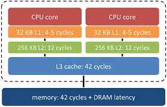
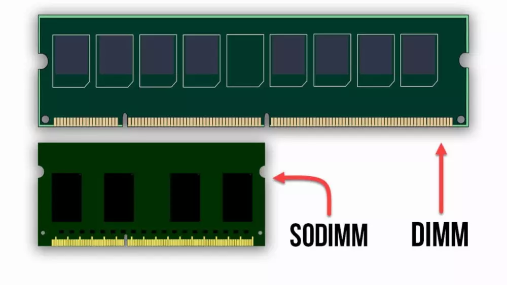

<!--
Metodología: Learning by Doing (Aprender Haciendo) 🧠. Cada sesión se estructura en:

    Píldora Teórica (10-15 min): Una explicación muy directa, visual y llena de analogías para presentar el concepto del día.

    Actividad Práctica (30-35 min): Una misión o reto, individual o en equipo, para aplicar y asimilar lo aprendido de forma inmediata.

    Puesta en Común (5 min): Breve repaso de las conclusiones de la actividad.


-->

Durante las próximas dos semanas, nos convertiremos en consultores tecnológicos de primer nivel. Una de las responsabilidades más importantes de un **agente digitalizador** es saber escuchar, analizar y, sobre todo, asesorar eficazmente a sus clientes. Cada cliente es un mundo, con sus propias características y necesidades específicas a cubrir.

¿Creéis que un **diseñador gráfico** que trabaja con vídeo en 4K y modelado 3D necesita el mismo ordenador que una **peluquería** que solo quiere gestionar sus citas, llevar la contabilidad y manejar sus redes sociales? La respuesta es un rotundo no. Y ahí es donde entráis vosotros.

Elegir los componentes de un sistema informático no es solo una tarea técnica; es un arte. Es el arte de equilibrar **rendimiento, presupuesto y sostenibilidad** para ofrecer la solución perfecta a cada problema.

## Sesión 1: "El Cuerpo y el Alma" (HW y SW)

Hoy empezamos nuestro viaje para convertirnos en Agentes Digitalizadores. Y la primera pregunta es: ¿qué tienen en común un robot, un móvil y una persona?

{.center width=80%}

Todos tienen un cuerpo y una 'mente' que le dice a ese cuerpo qué hacer. En informática, a eso lo llamamos **Sistema Informático**.

**HARDWARE (El Cuerpo 🦾)** 
- El hardware son todas las partes físicas que podemos tocar. En una persona, son los huesos, los músculos, el cerebro, el corazón... En un ordenador, es la pantalla, el teclado, el ratón y, lo más importante, todo lo que hay dentro de la caja.

- El hardware es fuerte, pero por sí solo es inútil. Un cuerpo sin vida no hace nada.

**SOFTWARE (El Alma y los Pensamientos 🧠)**

- El software en una persona son sus pensamientos, su personalidad, su lenguaje... En un ordenador, es el sistema operativo (como Windows o MacOS) y todos los programas que usáis (Word, Chrome, juegos...).
- El software da vida al hardware. Sin software, un ordenador es solo una caja de metal y plástico.

Al igual que vuestros pensamientos (sw) le dicen a vuestro cuerpo (hw) qué hacer, del mismo modo, *Fortnite* (Sw) le dice a la tarjeta gráfica (hw) que dibuje un personaje en la pantalla.

!!! question "A103.1(CE1, CMCT2) Explorando el Hardware"

    **Objetivo**: Familiarizarse con los componentes HW. básicos de un sistema informático y su función.

    Haciendo uso de los siguientes recursos, haz un esquema conceptual de los componentes principales de un ordenador junto con una breve descripción de la función de cada uno:

    - [Vídeo: TODOS los COPONENTES y partes del PC en 5 minutos](https://youtu.be/fcrLFdn-oWE?si=FAh6Q5_u3CqIzZf-)
    - [Artículo: Guía con todos los componentes de un ordenador](https://www.pccomponentes.com/guia-componentes-ordenador?srsltid=AfmBOoorQ8yVkuVZYFPv8F1P4kDLDCbKL7zgcPvAt3RAw5-3y-OJxnDM)
  
    Realiza la actividad de forma individual sobre un documento Microsoft Whiteboard de tu identidad digital, nombralo A103_1 seguido de tu nombre, por ejemplo, en mi caso sería "A103_1 Javier Perales"

    Haciendo uso de "Exportar/Alta resolución", exporta el archivo en un documento png y sube la respuesta en la actividad correspondiente de la plataforma *Aules*.

---

## Sesión 2: "El Cerebro de la Operación" (El Procesador o CPU)

Se podría decir que el procesador es el "cerebro" del ordenador 🧠. Es el encargado de ejecutar todas las instrucciones y cálculos necesarios para que el sistema funcione correctamente.

Imagina el ordenador como una gran fábrica. El procesador será el jefe de producción. Decide qué tareas se deben hacer, da órdenes a los trabajadores (la memoria, la tarjeta gráfica, los periféricos...) y supervisa que el trabaja se haga de manera eficiente y rápida.

Al analizar un procesador (CPU), hay varios factores clave que debes tener en cuenta para comprender su rendimiento y cómo se adapta a tus necesidades. Aquí te resumo los aspectos más importantes que debes saber:

### 2.1 Arquitectura del Procesador

Se refiere al diseño y estructura interna del procesador. Ojo, no hay que confundirlo con las marcas de los procesadores. Las arquitecturas más comunes son:

- **x86** (Intel y AMD) y 
- **ARM** (desde 2020, *Apple* ha empezado a utilizar sus propios procesadores basados en ARM, la serie M (M1, M2, ...) aunque tambien se utilizan en dispositivos móviles y servidores).

#### Arquitectura x86

- **Diseño CISC** (Complex Instruction Set Computing): Esta arquitectura se caracteriza por un conjunto de instrucciones complejo, lo que permite ejecutar operaciones multifacéticas en una sola instrucción.
- Fabricantes principales: **Intel** y **AMD** son los desarrolladores más destacados de procesadores x86.
- Dispositivos comunes: Predominantemente utilizada en ordenadores de escritorio, portátiles y servidores, donde el rendimiento y la compatibilidad son primordiales.

#### Arquitectura ARM:

- **Diseño RISC** (Reduced Instruction Set Computing): Se enfoca en un conjunto de instrucciones más simple y eficiente, optimizando el consumo energético y el rendimiento por vatio.
- Fabricantes principales: ARM Holdings licencia su arquitectura a diversos fabricantes, entre ellos **Qualcomm**, **Apple**, **Samsung** y **NVIDIA**.
- Dispositivos comunes: Ampliamente implementada en dispositivos móviles como smartphones y tabletas, así como en sistemas embebidos y, más recientemente, en algunos portátiles y servidores debido a su eficiencia energética.

#### Diferencias clave:

- Eficiencia energética: Los procesadores ARM suelen consumir menos energía, lo que los hace ideales para dispositivos móviles y aplicaciones donde la duración de la batería es crucial.- 
- Rendimiento: Los procesadores x86 ofrecen un alto rendimiento y son compatibles con una amplia gama de aplicaciones de escritorio y servidor.- 
- Compatibilidad de software: La arquitectura x86 tiene una larga trayectoria en el mercado de PC, lo que garantiza una amplia compatibilidad con software existente. ARM está ganando terreno, especialmente con sistemas operativos y aplicaciones diseñadas específicamente para su arquitectura.

### 2.2 Frecuencia de reloj (*Clock Speed*)

La **frecuencia de los procesadores se mide en gigahercios (GHz)**, que representan miles de millones de ciclos por segundo. Un procesador de 3.5 GHz, por ejemplo, ejecuta 3,500 millones de ciclos cada segundo.

Cuanto mayor es la frecuencia en GHz, más rápido puede ejecutar operaciones, aunque esto no siempre implica mayor rendimiento general (depende de otros factores como la arquitectura del procesador y la eficiencia energética).

### 2.3 Número de núcleos (*Cores*)

Un núcleo es una unidad de procesamiento independiente dentro del procesador. **Cuantos más núcleos tenga un procesador, más tareas puede manejar simultáneamente**. Procesadores con múltiples núcleos (dual-core, quad-core, octa-core, etc.) son mejores para multitarea y aplicaciones que requieren procesamiento paralelo.

!!! warning "Importante"

    Con el lanzamiento de los procesadores Intel Core de 12ª Generación (*Alder Lake*), Intel dio un gran paso adelante en esta filosofía, presentando dos tipos diferentes de núcleos dentro de un mismo procesador.

    - Los **P-Cores** se llaman así porque la P viene de Performance, rendimiento en inglés.
    - Los **E-Cores** se llaman así porque la E viene de Efficiency, eficiencia en inglés.
    - **LP E-Core**, que sería un núcleo de ultra-bajo consumo. 

    Actualmente, Intel está en la 14ª generación de procesadores, conocida como **Raptor Lake Refresh**, con hasta 24 nucleos (8 P-Cores + 16 E-Cores).

    Intel también tiene otras líneas de procesadores, como los procesadores Intel Xeon para servidores y estaciones de trabajo.  Sin embargo, la línea **Intel Core** es la más conocida y utilizada en ordenadores de sobremesa y portátiles.

### 2.4 Número de Hilos (Threads)

Los hilos son las unidades más pequeñas que gestionan las tareas dentro de un núcleo. Algunos procesadores tienen tecnología de multithreading (como *Hyper-Threading de Intel*) que permite a un núcleo manejar más de un hilo simultáneamente.

Más hilos permiten un mejor rendimiento en aplicaciones multitarea y tareas que se benefician del paralelismo, como edición de video o renderizado 3D.

**Solo los P-core tienen hilos**

### 2.5 Memoria Caché

La caché es una memoria muy rápida integrada en la CPU para almacenar datos e instrucciones de uso frecuente.
Tipos:
- L1: Pequeña y ultrarrápida, cercana a los núcleos.
- L2: Un poco más grande y más lenta que L1.
- L3: Compartida entre todos los núcleos, más lenta pero de mayor capacidad.

La caché ayuda a acelerar el acceso a datos y reduce la necesidad de ir a la RAM para obtener información, mejorando el rendimiento general.

{.center}

### 2.6 Socket

El *Socket* o zócalo es la interfaz física que conecta el procesador a la placa base. Cada tipo de procesador requiere un socket específico, por lo que es crucial asegurarse de que el procesador y la placa base sean compatibles.

**Recurso:** [Socket 2'40''- 5'](https://youtu.be/W7XsGOx_RPA?si=5Xt-dVJngZZ-5yBZ&t=166)

!!! question "A103.2(CE1, CMCT2) Procesadores"

    Completa el diagrama conceptual de la actividad anterior con las características más relevantes que se han presentado durante esta sesión.
    
    Exporta el diagrama en png, al igual que has hecho en la actividad anterior y adjunta el documento en la tarea de *Aules*. Recuerda nombrar el archivo como A103_2 seguido de tu nombre y apellido.

---

## Sesión 3: "Procesadores - 2ª Parte"

!!! question "A103.3(CE1, CMCT2) Características de procesadores"

    Completa la siguiente tabla comparando las características clave de los procesadores indicados. Investiga y rellena cada campo utilizando los recursos proporcionados. Presta especial atención a la frecuencia base y turbo, el número de núcleos e hilos, la memoria caché y el tipo de socket de cada modelo.

    | Característica             | AMD Ryzen 7 5800H | Intel Core i9-13980HX | AMD Ryzen 9 7945HX | Intel Core i9-13900K |
    |----------------------------|-------------------|-----------------------|--------------------|----------------------|
    | **Frecuencia reloj base**  |                   |                       |                    |                      |
    | **Frecuencia turbo**       |                   |                       |                    |                      |
    | **Número de núcleos**      |                   |                       |                    |                      |
    | **Hilos**                  |                   |                       |                    |                      |
    | **Caché**                  |                   |                       |                    |                      |
    | **Socket**                 |                   |                       |                    |                      |
    | **PC escritorio o portátil**                 |                   |                       |                    |                      |

    **Recursos de apoyo:**

    - [Significado de los nombres de procesadores Intel y AMD (Prime Tech Support)](https://primetechsupport.com/es/blogs/gaming-pc-repairs/decoding-cpu-names-understanding-amd-intels-nomenclature)
    - [Entendiendo los nombres de Intel](https://www.intel.com/content/www/us/en/processors/processor-numbers.html)
    - [Entendiendo los nombres de AMD](https://medium.com/@meCreator/01-understanding-amd-processor-names-3a89261dcd99)
    - [Características de procesadores Intel](https://www.intel.la/content/www/xl/es/products/details/processors.html)
    - [Características de procesadores AMD](https://www.amd.com/es/products/specifications/processors.html)
    - [Especificaciones de procesadores Intel y AMD (TechPowerUp)](https://www.techpowerup.com/cpu-specs/)

    Responde a la actividad en un documento Word, nómbralo como A103.3 seguido de tu nombre y apellido, y adjúntalo a la tarea correspondiente en *Aules*.

---

## Sesión 4: Memoria RAM

La memoria RAM (**Random Access Memory**) es una memoria de acceso rápido y volátil que almacena temporalmente datos e instrucciones que el procesador necesita mientras se ejecutan programas o aplicaciones.

### 4.1 Magnitudes de memoria

La capacidad de almacenamiento de las memorias se mide en bytes (B) y sus múltiplos:

- 1 byte (B) = 8 bits (la unidad más pequeña de información en informática, que puede ser 0 o 1)
- 1 Kilobyte (KB) = 1.024 bytes
- 1 Megabyte (MB) = 1.024 KB = 1.048.576 bytes
- 1 Gigabyte (GB) = 1.024 MB = 1.073.741.824 bytes
- 1 Terabyte (TB) = 1.024 GB = 1.099.511.627.776 bytes
- 1 Petabyte (PB) = 1.024 TB = 1.125.899.906.842.624 bytes
- 1 Exabyte (EB) = 1.024 PB = 1.152.921.504.606.846.976 bytes

**La capacidad de la memoria RAM en un ordenador se mide en gigabytes (GB). Cuanta más memoria RAM tenga un ordenador, más datos e instrucciones podrá almacenar temporalmente, lo que mejora el rendimiento y la capacidad multitarea del sistema.**

!!! question "A103.4 (parte1/3) (CE1, CMCT2) Conversión de magnitudes de memoria"

    **Antes de empezar, repasemos las dos reglas claves:**

    - Para convertir una unidad mayor a menor (por ejemplo de GB a MB), multiplica por 1.024.
    - Para convertir una unidad menor a mayor (por ejemplo de MB a GB), divide por 1.024.

    ```
    ▲  (Dividir ÷ 1024)
    TB
    GB
    MB
    KB
    Bytes
    ▼  (Multiplicar x 1024)
    ```
    **Calentamiento:**
    1. De grande a pequeño:
        - 4 TB = ? MB
        - 2 MB = ? KB
        - 20 GB = ? KB
    2. De pequeño a grande:
        - 3.072 MB = ? GB
        - 5.120 KB = ? MB
        - 8.388.608 KB = ? GB
  
    **Actividad principal:**

    1. El fotografo. Tiene una tarjeta de memoria de 16GB. Si cada foto que hace en alta calidad ocupa 8MB, ¿cuántas fotos puede almacenar en la tarjeta antes de llenarla?
    2. El cinefilo. Si quieres descargar una película que ocupa 3.072 MB y tu pendrive tiene una capacidad de 4GB ¿tienes espacio suficiente para guardarla? ¿Cuánto espacia te sobraría o faltaría (en MB)?
    3. El músico. Tienes 100 canciones en formato MP3 y cada una ocupa 5.120 KB. ¿puedes guardarlas todas en un CD que tiene capacidad de 700 MB?
    **Recursos de apoyo:**

    - [Conversor de unidades de memoria (UnitConverters)](https://www.unitconverters.net/data-storage-converter.html)
  
    **Responde a la actividad en un documento Word, nómbralo como A103_4_RAM seguido de tu nombre y apellido, y adjúntalo a la tarea correspondiente en *Aules*.**


    
### 4.2 Factor de forma

El factor de forma de la RAM DDR se refiere a su tamaño físico y disposición de pines, siendo comúnmente **DIMM** (Dual In-line Memory Module) para ordenadores de sobremesa y **SO-DIMM** (Small Outline DIMM) para portátiles y dispositivos compactos.

{.center width=60%}


### 4.3 Tipos de RAM

| Tipo de RAM | Año de lanzamiento | Velocidad de reloj | Transferencia de Datos (MT/s) | Velocidad de Transferéncia | Voltatge | Pins |
|-------------|--------------------|--------------------|-------------------------------|----------------------------|----------|------|
| DDR         | 2000               | 100 - 200          | 200 - 400                     | 1,6 - 3,2 GB/s             | 2,5V     | 184  |
| DDR2        | 2003               | 266 - 533          | 533 - 1066                    | 4,2 - 8,5 GB/s             | 1,8V     | 240  |
| DDR3        | 2007               | 533 - 1066         | 1066 - 2133                   | 8,5 - 17 GB/s              | 1,5V     | 240  |
| DDR4        | 2014               | 1066 - 1600        | 2133 - 3200                   | 17 - 25,6 GB/s             | 1,2V     | 288  |
| DDR5        | 2020               | 2400 - 4200        | 4800 - 8400                   | 38,4 - 67,2 GB/s           | 1,1V     | 288  |

*MT/s= Millones de transferencias por segundo. Unatransferencia es un bloque de 64bits.*

En 2025 la mayoría de los ordenadores nuevos vendrán con **DDR5**, pero aún hay muchos equipos con **DDR4**. Las generaciones anteriores (DDR3, DDR2 y DDR) ya están obsoletas y no se usan en equipos nuevos.

### 4.4 Marcas de memoria RAM

Solo tres empresas fabrican la mayoría de los chips de memoria: **Samsung, Micron y SK Hynix**. Las marcas como Corsair o G.Skill compran estos chips, los clasifican según su calidad (binning), y los montan en sus propias placas con disipadores de calor y luces RGB. Por tanto, más alla de la marca, fíjate en estas especificaciones:

1. Tipo de memoria (DDR4, DDR5...)
1. Velocidad (3200MHz, 3600MHz...)
1. Capacidad (8GB, 16GB, 32GB...)
1. Latencia (CL16, CL18...) - Cuanto menor sea la latencia, mejor. La latencia es el tiempo que tarda la RAM en responder a una solicitud del procesador.

Algunas de las marcas más reconocidas y confiables en el mercado de memoria RAM son:

- [Corsair](https://www.corsair.com/es/es/c/memory)
- [Kingston](https://www.kingston.com/es/memory)
- [Crucial](https://www.crucial.com/memory)

!!! question "A103.5 (CE1, CMCT2) Diagrama conceptual de memoria RAM"

    Completa el diagrama conceptual de la actividad A103.2 añadiendo las características más relevantes de la memoria RAM que se han presentado durante esta sesión.

        
### 4.5 Problemas al no tener suficiente RAM

Cuando un ordenador se queda sin RAM, comienza a utilizar el espacio del disco duro como si fuera RAM, lo que es mucho más lento. Esto puede hacer que el sistema operativo y las aplicaciones se vuelvan extremadamente lentos o incluso se bloqueen. Los problemas más comunes son:

- **Lentitud extrema del sistema**
- **Imposibilidad de realizar multiples tareas**: Cambiar de una aplicación a otra se convierte en una espera interminable.
- **Bloqueos y fallos de aplicaciones**: Estás trabajando en un documento o jugando y, de repente, la imagen se congela o la aplicación se cierra inesperadamente.
- **Pantallazos azules**: en casos extremos, la falta de RAM no solo afecta a las aplicaciones, sino a todo el sistema operativo, provocando reinicios inesperados o pantallazos azules de la muerte.

!!! note "Análisis uso de memoria"

    En Windows, puedes ver el uso de la memoria RAM en el "Administrador de Tareas" (Ctrl + Shift + Esc) en la pestaña "Rendimiento". Aquí puedes ver cuánta RAM está siendo utilizada y cuánta está disponible.

    En Linux, puedes usar el comando `free -h` en la terminal para ver el uso de la memoria RAM.

    Observa cómo cambia el uso de la memoria cuando abres diferentes aplicaciones o pestañas del navegador. 


!!! question "A103.6(CE1, CMCT2) ¿Cuánta RAM necesito?"

    Vuestra misión será investigar la cantidad de memoria RAM que necesitan los programas y juegos más populares para poder dar recomendaciones personalizadas y fundamentadas a diferentes perfiles de usuario.

    Responde las cuestiones en un documento Word, nómbralo como A103_4 seguido de tu nombre y apellido, y adjúntalo a la tarea correspondiente en *Aules* en formato pdf.

    **Fase 1: Investigación.** Completa la siguiente tabla.

    **Instrucción clave:** Para la búsqueda, usad términos como: *"requisitos recomendados RAM [nombre del programa]"*

    | Programa / Juego              | Uso Principal      | Requisitos Mínimos de RAM | Requisitos Recomendados de RAM |
    |-------------------------------|-------------------|---------------------------|--------------------------------|
    | **Sistema Operativo**         |                   |                           |                                |
    | Windows 11                    | Básico            | 4 GB                      | 8 GB                           |
    | **Navegador**                 |                   |                           |                                |
    | Google Chrome (20 pestañas)   | Navegación        |                            |                           |
    | **Ofimática**                 |                   |                      |                           |
    | Microsoft Word                | Textos            |                      |                           |
    | **Diseño Gráfico**            |                   |                      |                           |
    | Adobe Photoshop               | Edición fotos     |                      |                           |
    | GIMP (alternativa gratuita)   | Edición fotos     |                      |                           |
    | **Videojuegos**               |                   |                      |                           |
    | Valorant                      | E-sports          |                      |                           |
    | Cyberpunk 2077                | AAA               |                      |                           |
    | **Edición de Vídeo / Streaming** |                 |                      |                           |
    | DaVinci Resolve               | Edición vídeo     |                      |                           |
    | OBS Studio                    | Streaming         |                      |                           |

    **Fase 2: El Análisis y los Perfiles**
    
    Una vez completada la tabla, cada equipo recibirá un perfil de usuario para analizar. Vuestra tarea es calcular sus necesidades y decidir qué cantidad de RAM recomendar.

    === "Perfil 1. La Abuela Conectada 👵"

        Tareas: Usa el ordenador para leer el correo electrónico (en el navegador), ver recetas en YouTube (2-3 pestañas abiertas) y hacer videollamadas con la familia.
        
        Pregunta clave: ¿Son suficientes 4GB? ¿Le recomendarías 8GB para que el ordenador le dure más tiempo sin ir lento? Justifica tu respuesta.

    === "Perfil 2. El Estudiante Multitarea 📚"

        Tareas: Necesita tener Word abierto para tomar apuntes, 15-20 pestañas de Chrome para investigar, Spotify de fondo y a veces edita imágenes sencillas con GIMP para sus trabajos.

        Pregunta clave: Está dudando entre 8GB y 16GB. ¿Cuál le recomiendas? Explica qué problemas podría tener si elige la opción más barata (8GB).

    === "Perfil 3.El Primo YouTuber 🎮"

        Tareas: Juega a Valorant mientras graba la pantalla con OBS Studio. Después, edita esos vídeos en DaVinci Resolve. Mientras renderiza un vídeo, suele tener Discord y varias pestañas de Chrome abiertas.

        Pregunta clave: ¿Le bastaría con 16GB o debería ir directamente a por 32GB? Argumenta tu decisión basándote en la suma de RAM que necesitarían sus programas funcionando a la vez.

<!--
## Sesión 5. Almacenamiento secundario (Disco Duro: SSD vs. HDD)

l almacenamiento secundario se refiere a los dispositivos de almacenamiento de datos que se utilizan para guardar información de forma permanente, incluso cuando el ordenador está apagado. Los dispositivos de almacenamiento secundario más comunes son los discos duros (**HDD**), las unidades de estado sólido (**SSD**).

En el siguiente enlace dispones de un [video](https://www.youtube.com/watch?v=V7qg1WGSdvc) que muestra la evolución de los dispositivos de almacenamiento.


**Recurso:**
- [Capacidad de almacenamiento](https://youtu.be/W7XsGOx_RPA?si=TuVU2b_M7Nc2zB2M&t=653)


---


## Sesión 4: "El Gran Almacén" (Disco Duro: SSD vs. HDD)

    Píldora Teórica:

        Analogía: El disco duro es el almacén o la biblioteca 📚 donde se guarda todo a largo plazo (fotos, juegos, documentos).

        Tipos:

            HDD (Disco Duro Mecánico): Como una biblioteca con un bibliotecario que busca los libros a mano. Más lento, pero más barato y con más capacidad.

            SSD (Unidad de Estado Sólido): Como una biblioteca digital con un buscador instantáneo. Muchísimo más rápido, pero más caro.

    Actividad: "Duelo de Velocidad y Presupuesto" ⏱️💰

        Objetivo: Comprender la diferencia de rendimiento y coste entre SSD y HDD.

        Desarrollo:

            Visualización (5 min): Se les muestra un vídeo corto de YouTube comparando el tiempo de arranque de Windows y la carga de un juego en un HDD vs. un SSD. El impacto visual es inmediato.

            Reto (25 min): Con un presupuesto fijo de 100€, deben buscar en una tienda online la mejor configuración de almacenamiento para:

                Opción A (Máxima Capacidad): Conseguir el mayor espacio posible.

                Opción B (Máxima Velocidad): Conseguir la mayor velocidad posible.

                Opción C (Configuración Híbrida): Un SSD pequeño para el Sistema Operativo y un HDD para guardar archivos.

## Sesión 5: "El Artista y el Esqueleto" (Tarjeta Gráfica y Placa Base)

    Píldora Teórica:

        Tarjeta Gráfica (GPU): Es el artista 🎨 del equipo. Se encarga de dibujar todo lo que ves en el monitor. Esencial para videojuegos y diseño. Si no haces nada de eso, con una básica es suficiente.

        Placa Base: Es el esqueleto y sistema nervioso que conecta TODOS los componentes entre sí. Su principal característica es la compatibilidad: no todas las placas sirven para todos los procesadores.

    Actividad: "El Puzzle de la Compatibilidad" 🧩

        Objetivo: Entender el concepto de compatibilidad.

        Desarrollo: Se utiliza una herramienta online como PCPartPicker.

            Se les da un procesador que eligieron en la sesión 2 (ej. un AMD Ryzen 5).

            Su misión en la web es seleccionar ese procesador y ver cómo la propia herramienta filtra y muestra solo las placas base compatibles.

            Después, añaden la memoria RAM y el disco duro de las sesiones anteriores. El objetivo es que vean cómo se van "encajando las piezas" del puzzle digital.

## Sesión 6: "Consolidación" (Repaso y Ensamblaje Virtual)

    Píldora Teórica:

        Repaso rápido de todos los componentes y su función.

        Se introduce la diferencia entre PC y Mac (hardware más cerrado vs. abierto) y los Sistemas Operativos (Windows, MacOS, Linux) como el "director de orquesta" de todo el sistema.

    Actividad: "Mi Primer Presupuesto de Agente Digitalizador" 🚀

        Objetivo: Aplicar todo lo aprendido para crear un presupuesto completo.

        Desarrollo: Esta es la actividad final que los prepara para la Situación de Aprendizaje. Se les asigna un perfil de cliente completo:

            "Cliente Final: Un fotógrafo aficionado que necesita un ordenador para editar sus fotos en Lightroom, que sea rápido al abrir programas y con bastante espacio para guardar sus archivos. Presupuesto máximo para la torre: 700€."

        Usando la herramienta online, deben configurar un PC completo (CPU, RAM, Disco, Gráfica, Placa Base, etc.) que cumpla los requisitos y no se pase del presupuesto. Deben hacer una captura de pantalla del resultado final.

-->
